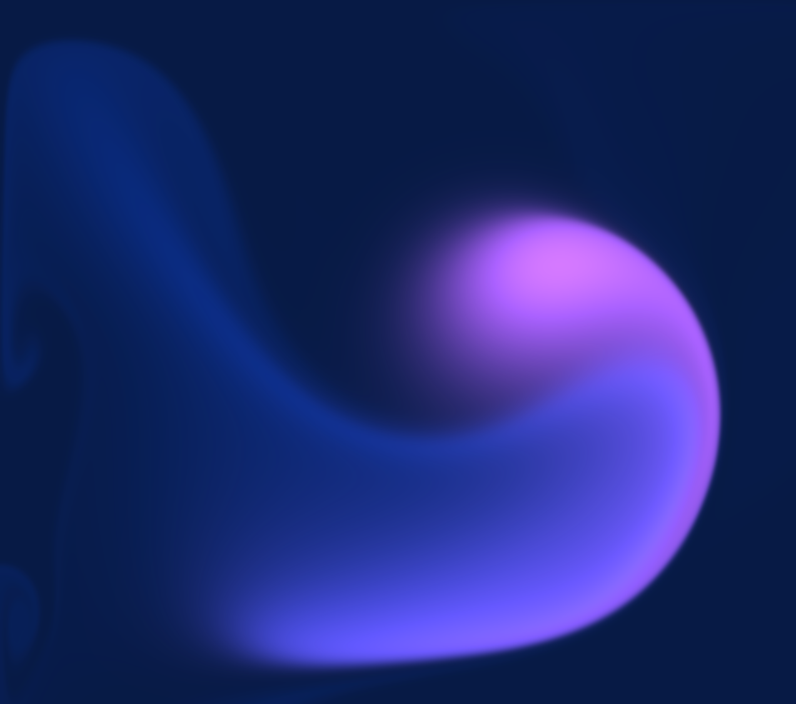

Simulation based on PavelDoGreat's [WebGL-Fluid-Simulation](https://github.com/PavelDoGreat/WebGL-Fluid-Simulation?tab=readme-ov-file) repository.

This code is used as the background for my personal portfolio, so any functionality that is not used for the desired effect, such as: Bloom, Sunrays, Capture, etc. have been removed.

In this particular implementation, the effect follows a pre-defined looped path as long as the mouse is not moving. When the movement is detected, the effect starts approaching the mouse until it snaps to its position, and then continues following it as usual.

When the mouse stops, the effect will start moving towards the prefixed position and continue the loop as before.
